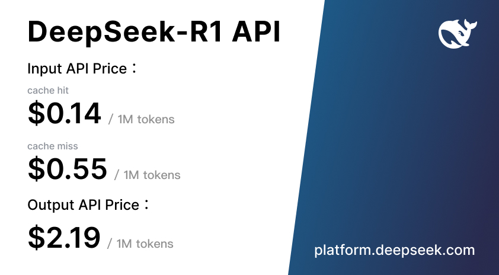

# 🚀 DeepSeek-R1 is here!

⚡ Performance on par with OpenAI-o1
📖 Fully open-source model & technical report
🏆 MIT licensed: Distill & commercialize freely!

🌐 Website & API are live now! Try DeepThink at http://chat.deepseek.com today!

🔥 Bonus: Open-Source Distilled Models!

🔬 Distilled from DeepSeek-R1, 6 small models fully open-sourced
📏 32B & 70B models on par with OpenAI-o1-mini
🤝 Empowering the open-source community

🌍 Pushing the boundaries of **open AI**!

📜 License Update!

🔄 DeepSeek-R1 is now MIT licensed for clear open access
🔓 Open for the community to leverage model weights & outputs
🛠️ API outputs can now be used for fine-tuning & distillation

🛠️ DeepSeek-R1: Technical Highlights

📈 Large-scale RL in post-training
🏆 Significant performance boost with minimal labeled data
🔢 Math, code, and reasoning tasks on par with OpenAI-o1
📄 More details: https://github.com/deepseek-ai/DeepSeek-R1/blob/main/DeepSeek_R1.pdf

🌐 API Access & Pricing

⚙️ Use DeepSeek-R1 by setting model=deepseek-reasoner
💰 $0.14 / million input tokens (cache hit)
💰 $0.55 / million input tokens (cache miss)
💰 $2.19 / million output tokens

📖 API guide: https://api-docs.deepseek.com/guides/reasoning_model

